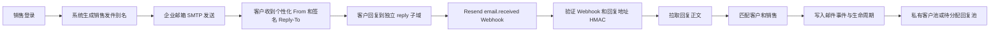

# 统一发件身份与自动回信归属

## 目标

系统使用统一 SMTP 发信和集中回信基础设施，但每个销售对客户显示独立身份：

- 默认显示 `Viki <partnerships@outreach.vertu.cn>`，客户仍能识别具体销售；
- 邮箱后台授予 Send As 权限后，可显示 `Viki <viki@outreach.vertu.cn>`；
- 销售不需要提供企业邮箱密码或 SMTP 授权码；
- 每封邮件的 `Reply-To` 都是不可伪造的签名地址；
- 客户回复后，系统自动识别联系人、原销售和触达轮次；
- 已有负责人时保留当前负责人；没有负责人时恢复给原发送销售；仍无法归属时进入“待分配回复”。

## 数据流



## 生产环境变量

```dotenv
OUTBOUND_IDENTITY_MODE=centralized_alias
OUTBOUND_SENDING_DOMAIN=outreach.vertu.cn
OUTBOUND_REPLY_DOMAIN=reply.outreach.vertu.cn
REPLY_ROUTING_SECRET=至少32位、与其他密钥不同的随机字符串
RESEND_API_KEY=re_xxx
RESEND_WEBHOOK_SECRET=whsec_xxx
MAIL_PROVIDER=smtp
SMTP_HOST=smtp.exmail.qq.com
SMTP_PORT=465
SMTP_USER=partnerships@outreach.vertu.cn
SMTP_PASSWORD=客户端专用密码
SMTP_SECURITY=ssl
SMTP_ALLOW_FROM_ALIAS=false
```

`REPLY_ROUTING_SECRET`、`TRACKING_SIGNING_SECRET` 和 `RESEND_WEBHOOK_SECRET` 必须是三个不同的值，不得提交到 Git。

## Resend 与 DNS

1. 在 Resend 添加并验证 `outreach.vertu.cn`，完成 DKIM/SPF 配置。
2. 在 Resend 为 `reply.outreach.vertu.cn` 启用 Receiving，按页面提供的值添加 MX 记录。
3. 不要修改 `vertu.cn` 根域现有企业邮箱 MX；回信使用独立子域，避免影响腾讯企业邮箱。
4. 在 Resend Webhooks 使用：

   `https://global-autoleads.vertu.cn/webhooks/resend`

5. 至少勾选 `email.received`、`email.sent`、`email.delivered`、`email.opened`、`email.clicked`、`email.bounced`、`email.complained`、`email.failed`。
6. 将该 Webhook 的 Signing Secret 填入 `RESEND_WEBHOOK_SECRET`。

SMTP 负责发送，Resend 只负责独立回复子域的 Receiving。Receiving Webhook 只包含邮件元数据，系统会再调用 Resend Received Email API 拉取正文。

## 管理员操作

- 管理员控制台可为每个用户设置“发件别名”；留空时自动使用登录账号名。
- `reply_to_email` 继续作为销售真实企业邮箱映射记录，不再直接暴露为客户回复地址；客户回复在网站私有客户池中处理。
- 发件账号池仍代表底层 API/额度账号；销售别名只代表客户看到的身份，两者已分离。

## 上线检查

```powershell
salesbot migrate --config config.yaml
salesbot doctor --config config.yaml
```

然后用一个测试客户发送邮件，确认：

1. From 是当前登录销售的别名；
2. Reply-To 类似 `reply+v1.385.11.1.<signature>@reply.outreach.vertu.cn`；
3. 回复后网站出现 `replied` 事件和回复正文；
4. 客户归属发送销售，SABCD 至少进入 C；
5. 重放同一个 Webhook 不会重复创建回复记录。

## 回滚

将 `OUTBOUND_IDENTITY_MODE=legacy` 并重启服务，系统会恢复原来的发件账号 From 和用户 `reply_to_email`。迁移 023 的字段可以保留，不影响旧流程。
