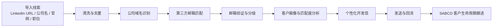

# LinkedIn 主页匹配联系方式方案说明（对外版）

更新日期：2026-07-08

## 1. 方案目的

这个方案解决的是外贸/BD 团队常见问题：

> 已经有一批目标客户的 LinkedIn 主页、公司名、官网或职位信息，但不知道如何稳定拿到可触达的邮箱、社媒和客户画像。

我的做法不是依赖单一工具，而是把“LinkedIn 主页 -> 联系方式 -> 邮件触达 -> 回流跟进”拆成一条可复用的数据链路。

## 2. 整体流程

## 3. 使用哪些第三方

| 第三方 | 主要用途 | 适合场景 | 说明 |
|---|---|---|---|
| Prospeo | 通过姓名、公司、官网、LinkedIn URL 匹配工作邮箱 | 主力邮箱发现 | 适合 B2B 公司联系人，欧美和资料完整客户效果更好 |
| Hunter | 邮箱查找、邮箱验证 | 验证邮箱是否可用 | 适合已知公司域名和人名后的邮箱验证 |
| PeopleDB / People Data Labs | 根据 LinkedIn 或公开资料补社媒和个人画像 | 补 LinkedIn、社媒、职位背景 | 更适合画像，不保证一定有邮箱 |
| Brave Search / Google CSE | 搜公开网页、官网、LinkedIn 公网页面 | 找官网、公开主页、联系方式 | 作为搜索层，不直接提供邮箱数据库 |
| 官网公开邮箱抓取 | 抓取 contact/about/team 页面邮箱 | 补充公司邮箱 | 多数是 info/sales/contact，不建议直接当个人邮箱 |
| 邮箱规则猜测 + 验证 | first.last@domain 等格式生成候选 | 公司邮箱格式规律明显时 | 必须验证后再发，不能盲发 |

## 4. 成本参考

价格会变化，下面只作为采购估算：

| 工具 | 免费额度 | 付费参考 | 适合怎么买 |
|---|---:|---:|---|
| Prospeo | 约 100 credits/月 | Starter 约 $49/月/用户，约 2,000 credits；Growth 约 $99/月/用户，约 5,000 credits | 先买小套餐测试真实命中率，再扩容 |
| Hunter | 约 50 credits/月 | Starter 约 $49/月，约 2,000 credits；Growth 约 $149/月，约 10,000 credits | 适合配合 Prospeo 做验证 |
| People Data Labs | 通常有试用或审核 | 多为用量/套餐制 | 不建议一开始重度买，用于高价值客户画像 |
| Brave Search / Google CSE | 有免费或低成本额度 | 低成本搜索 API | 用来找公开网页和官网，很适合做前置搜索 |

核心建议：

- 预算有限：Prospeo + Hunter + Brave Search 就够先跑。
- 想做客户画像：再接 PeopleDB / PDL。
- 不建议一开始买太多数据源，先用 1-2 周真实线索测命中率。

## 5. 成功率预期

联系方式匹配成功率和线索质量强相关，不是只看有没有 LinkedIn URL。

| 线索质量 | 预期效果 |
|---|---|
| LinkedIn URL + 英文姓名 + 公司官网 + 明确职位 | 成功率最高 |
| 姓名 + 公司官网，无 LinkedIn | 中等 |
| 只有公司名，没有负责人 | 较低 |
| 中东、俄语、阿语、小门店、酒店类客户 | 较低，需要增强搜索 |
| KOL / Instagram 博主 | 不能按传统 B2B 邮箱逻辑，需要专门抓 bio、Linktree、商务邮箱 |

我的经验是：

- 欧美 B2B、SaaS、科技、制造业：邮箱 API 命中率相对更好。
- 中东、俄罗斯、中亚、奢侈品门店、酒店渠道：直接用邮箱 API 命中率会偏低，需要官网、电话、WhatsApp、Instagram、Google/Brave 搜索一起用。
- 只有公司通用邮箱时，不建议直接进入自动群发，应作为“待人工确认”。

## 6. 数据准确度怎么控制

我把邮箱分成几类：

| 类型 | 是否可直接发 | 说明 |
|---|---:|---|
| 个人工作邮箱 + valid | 可以 | 如 `name@company.com`，且通过验证 |
| 个人工作邮箱 + unverified | 谨慎 | 可以保留候选，建议二次验证 |
| 公司通用邮箱 | 不建议自动发 | 如 info@、sales@、contact@ |
| 风险邮箱 / 退信邮箱 | 不发 | 避免影响发件域名信誉 |

原则是宁可少发，也不要把退信率打高。

## 7. 为什么不能只靠 LinkedIn

LinkedIn 主页本身通常不直接公开邮箱，而且登录态抓取有合规和风控风险。

更稳的方式是：

1. 用 LinkedIn URL 确认这个人是谁。
2. 用公司官网确认公司域名。
3. 用第三方数据源找邮箱。
4. 用邮箱验证工具确认是否可达。
5. 再进入邮件触达。

这样比直接爬 LinkedIn 更稳，也更适合生产环境。

## 8. 推荐落地路径

第一阶段：小规模测试

- 导入 100-300 条高质量线索。
- 字段至少包含：姓名、职位、公司、官网、LinkedIn URL。
- 用 Prospeo + Hunter 跑一轮。
- 统计命中率、有效率、退信率。

第二阶段：按地区优化

- 欧美客户：优先人名 + 官网 + LinkedIn。
- 中东客户：增加 WhatsApp、Instagram、官网 contact 页面。
- KOL 客户：单独走 Instagram / YouTube / Linktree 逻辑。

第三阶段：接入销售跟进

- 找到邮箱后，不直接群发模板。
- 先生成客户画像和痛点。
- 邮件按客户类型做半自动个性化。
- 根据打开、回复、退信进入不同跟进路径。

## 9. 这套方案的价值

这不是简单的“找邮箱工具”，而是一套外贸获客闭环：

- 找客户
- 找联系方式
- 判断客户质量
- 生成个性化开发信
- 发送邮件
- 跟踪打开/回复/退信
- 进入客户生命周期管理

相比人工一个个查，优势是：

- 节省大量搜索时间
- 数据字段统一
- 可以复用成功客户画像
- 能统计每个销售、每个地区、每个数据源的效果
- 更容易做规模化管理

## 10. 关键注意事项

1. 不要把所有候选邮箱都拿去发。
2. 不要只追求数量，退信率会伤害发件域名。
3. 不同地区命中率差异很大，必须分地区优化。
4. LinkedIn URL 是重要字段，但不是唯一字段。
5. 邮件内容必须基于客户画像和业务痛点，不要群发模板。

## 11. 官方参考

- Prospeo Pricing: https://prospeo.io/pricing
- Prospeo Enrich Person API: https://prospeo.io/api-docs/enrich-person
- Hunter Pricing: https://hunter.io/pricing
- Hunter Email Finder API: https://hunter.io/api/email-finder
- Hunter Email Verifier API: https://hunter.io/api/email-verifier
- People Data Labs Person Enrichment API: https://docs.peopledatalabs.com/docs/person-enrichment-api
