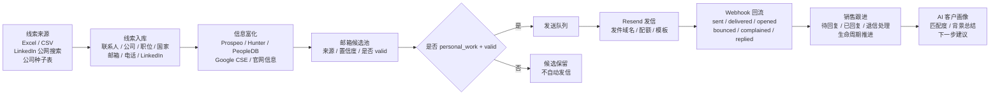
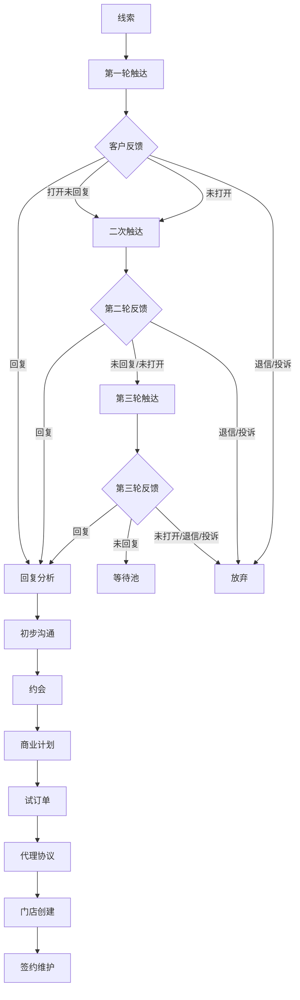
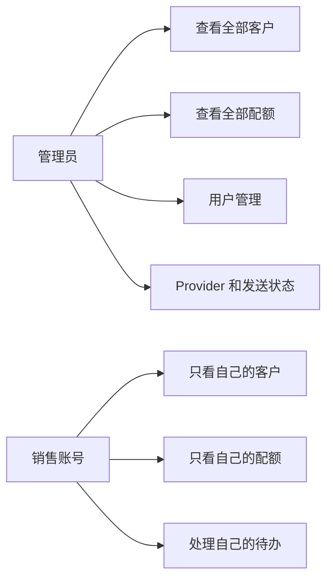

# 自动化获客系统设计思路

## 目标

把销售前期获客流程从“人工找人、人工猜邮箱、人工记录状态”升级为一套可登录、可导入、可富化、可发信、可回流、可跟进的销售自动化工作台。

第一阶段目标不是完全替代销售，而是把销售最耗时的前半段流程标准化：

- 导入目标公司或联系人
- 自动补全联系人信息
- 获取有效工作邮箱
- 个性化生成邮件
- 发送并跟踪邮件反馈
- 把客户推进生命周期管理

## 整体架构

## 核心模块

### 1. 线索导入

支持三类入口：

- 手动新增联系人
- CSV / Excel 导入已有客户表
- 公司种子表导入后自动搜索公开 LinkedIn 结果

导入后统一进入 `contacts`，避免不同来源的数据散落。

### 2. 信息富化

系统根据姓名、公司、职位、公司域名、LinkedIn URL 调用外部数据源：

- Prospeo：找人和邮箱富化
- Hunter：邮箱查找和验证
- PeopleDB：社媒和人物资料补全
- Google CSE：LinkedIn 公网搜索和公司官网查找
- 官网抓取：补充通用邮箱和电话候选

规则是：只有 `personal_work + valid` 的邮箱会写入正式邮箱字段。  
官网邮箱、info/support/contact 等只保留在候选池，不自动发信。

### 3. 邮件触达

邮件发送使用 Resend。

系统支持：

- 自定义邮件内容
- AI 根据客户资料生成个性化邮件
- 每人每日发信配额
- 全局发信配额
- 发件域名和发件账号管理
- 三轮触达节奏

邮件不是导入后立即自动群发，而是先进入队列，由销售或管理员确认后发送。

### 4. 状态回流

Resend Webhook 会把邮件事件回流到系统：

- sent：已发送
- delivered：已送达
- opened：已打开
- clicked：已点击
- bounced：退信
- complained：投诉/拉黑
- replied：已回复

这些状态会影响后续动作，例如退信和投诉客户会停止继续触达。

## 客户生命周期

## AI 的作用

AI 不只写邮件，而是参与销售判断：

- 根据客户公司、职位、行业生成个性化开场
- 总结客户背景
- 判断客户匹配度
- 分析客户回复内容
- 给下一步沟通建议
- 在商业计划、试订单、协议阶段提示风险点

## 权限设计

管理员负责系统运营，销售负责自己的客户跟进。

## 技术栈

- 前端：React
- 后端：Python HTTP Service
- 数据库：PostgreSQL
- 邮件服务：Resend
- AI：DeepSeek
- 数据源：Prospeo / Hunter / PeopleDB / Google CSE
- 部署：Docker Compose + HTTPS 反向代理

## 生产上线重点

上线前必须确认：

- PostgreSQL 可连接
- 数据库迁移已执行
- Resend 域名 DKIM/SPF/DMARC 已验证
- Resend Webhook 已配置
- `PUBLIC_BASE_URL` 是正式 HTTPS 地址
- 管理员密码已改强密码
- 销售账号权限隔离正常
- 邮箱发现和发信配额可控

## 当前定位

这套系统当前适合作为 3-30 人销售团队的轻量级获客工作台。

它能解决：

- 客户资料集中管理
- 多来源线索导入
- 邮箱和社媒补全
- 邮件触达
- 邮件状态回流
- 销售生命周期跟进

暂时不建议把它当成“完全无人值守群发机器”。生产使用时，建议保持销售确认、配额限制和退信/投诉保护。
